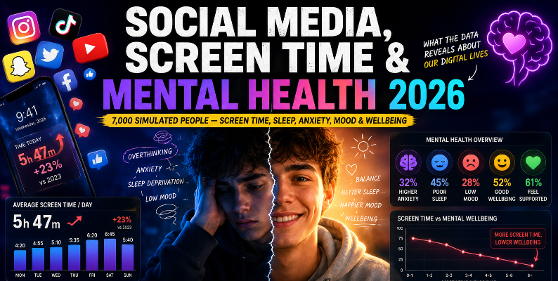

# Mental Health Analysis 2026 

This project explores the relationship between smartphone usage patterns and individual mental well-being. By analyzing key metrics such as daily screen time and notification frequencies, this study examines their correlation with mental health risk scores and overall well-being bands.

The analysis is based on a synthetic dataset retrieved from [Kaggle](https://www.kaggle.com/datasets/uditjain13/social-media-screen-time-and-mental-health-2026/code), with a particular focus on the most dominant platforms used by participants in 2026: TikTok, Instagram, and YouTube.

  

## Attachment

* [Data Preprocessing](https://colab.research.google.com/drive/1i4tCAv9MV6xu4adrbzX9j0GyfpbqDpcK#scrollTo=mb7aGXT8fblf)
* [Dashboard Page](https://github.com/gangsarfadhilm/Tugas_Portofolio/blob/main/Mental_health_analysis.pdf)
* [Portofolio](https://docs.google.com/presentation/d/1sAX1JuM4UKZi5KS_3lxbuKQEZ6olpsXQKPhCd1d1WZw/edit?usp=sharing)
* [Raw pbix file](https://github.com/gangsarfadhilm/Tugas_Portofolio/blob/main/Mental_health_analysis.pbix)

## The Dashboard Structure

The dashboard consists of 4 different pages:

* Overview: KPI of screen duration & daily notofication to risk and wellbeing score
* Trendline average daily screen hours by age
* User Segmentation who use daily screen times limiter
* Participant distribution by occupation and most used platform

* 

  

